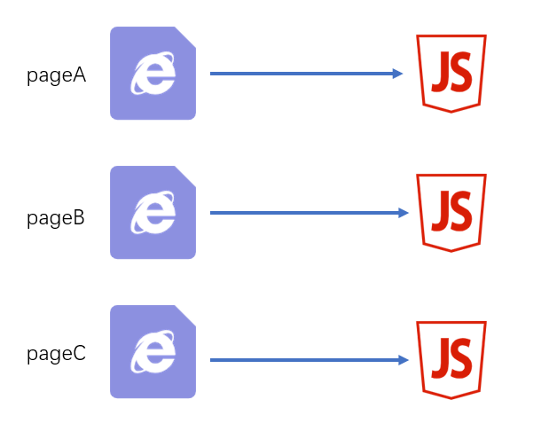
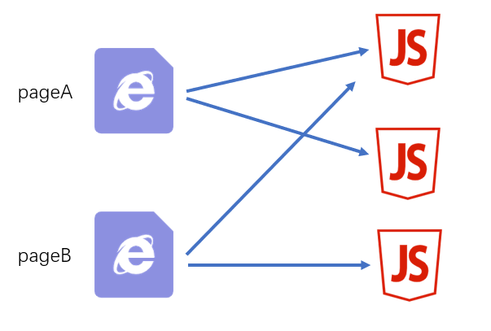
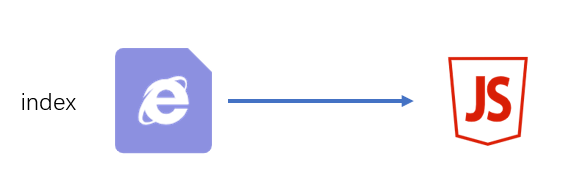

# 入口和出口的最佳实践 {ignore}

具体情况具体分析

下面是一些经典场景

## 一个页面一个JS



源码结构

```
|—— src
    |—— pageA   页面A的代码目录
        |—— index.js 页面A的启动模块
        |—— ...
    |—— pageB   页面B的代码目录
        |—— index.js 页面B的启动模块
        |—— ...
    |—— pageC   页面C的代码目录
        |—— main1.js 页面C的启动模块1 例如：主功能
        |—— main2.js 页面C的启动模块2 例如：实现访问统计的额外功能
        |—— ...
    |—— common  公共代码目录
        |—— ...
```

webpack配置

```js
module.exports = {
    entry:{
        pageA: "./src/pageA/index.js",
        pageB: "./src/pageB/index.js",
        pageC: ["./src/pageC/main1.js", "./src/pageC/main2.js"]
    },
    output:{
        filename:"[name].[chunkhash:5].js"
    }
}
```

这种方式适用于页面之间的功能差异巨大、公共代码较少的情况，这种情况下打包出来的最终代码不会有太多重复

## 一个页面多个JS



源码结构

```
|—— src
    |—— pageA   页面A的代码目录
        |—— index.js 页面A的启动模块
        |—— ...
    |—— pageB   页面B的代码目录
        |—— index.js 页面B的启动模块
        |—— ...
    |—— statistics   用于统计访问人数功能目录
        |—— index.js 启动模块
        |—— ...
    |—— common  公共代码目录
        |—— ...
```

webpack配置

```js
module.exports = {
    entry:{
        pageA: "./src/pageA/index.js",
        pageB: "./src/pageB/index.js",
        statistics: "./src/statistics/index.js"
    },
    output:{
        filename:"[name].[chunkhash:5].js"
    }
}
```

这种方式适用于页面之间有一些**独立**、相同的功能，专门使用一个chunk抽离这部分JS有利于浏览器更好的缓存这部分内容。

> 思考：为什么不使用多启动模块的方式？

## 单页应用

所谓单页应用，是指整个网站（或网站的某一个功能块）只有一个页面，页面中的内容全部靠JS创建和控制。 vue和react都是实现单页应用的利器。



源码结构

```
|—— src
    |—— subFunc   子功能目录
        |—— ...
    |—— subFunc   子功能目录
        |—— ...
    |—— common  公共代码目录
        |—— ...
    |—— index.js
```

webpack配置

```js
module.exports = {
    entry: "./src/index.js",
    output:{
        filename:"index.[hash:5].js"
    }
}
```

