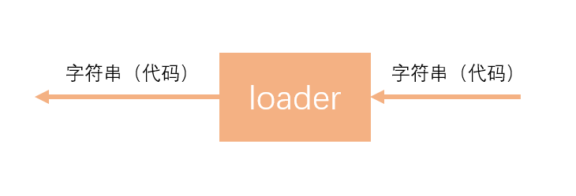
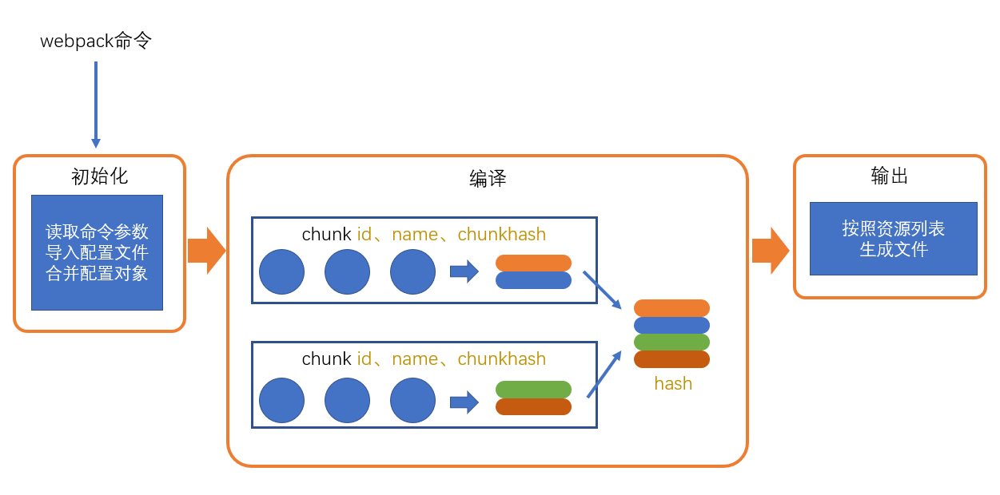
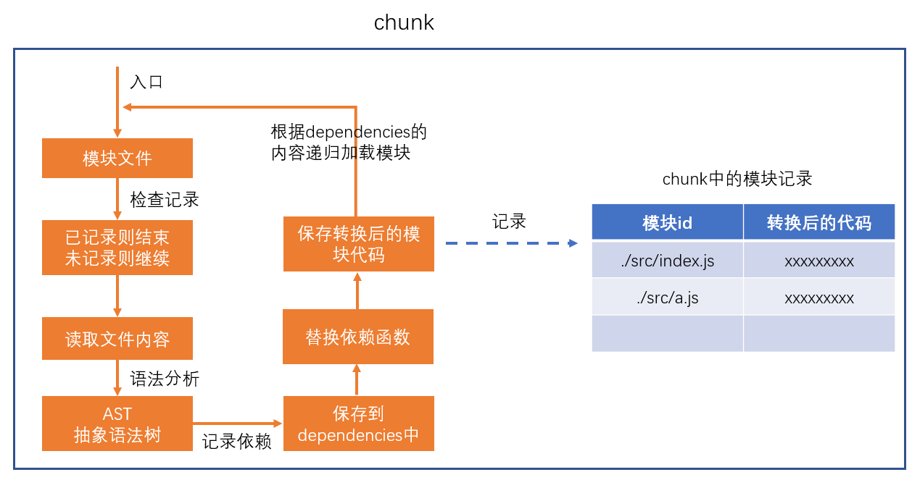
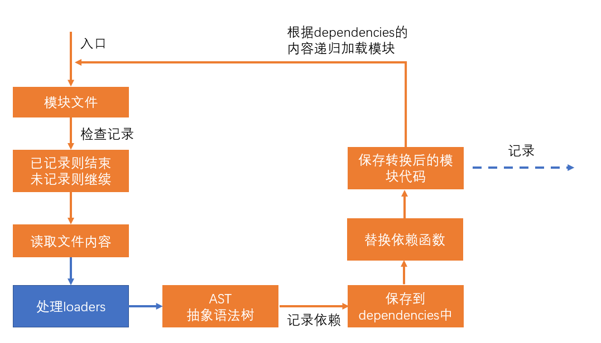
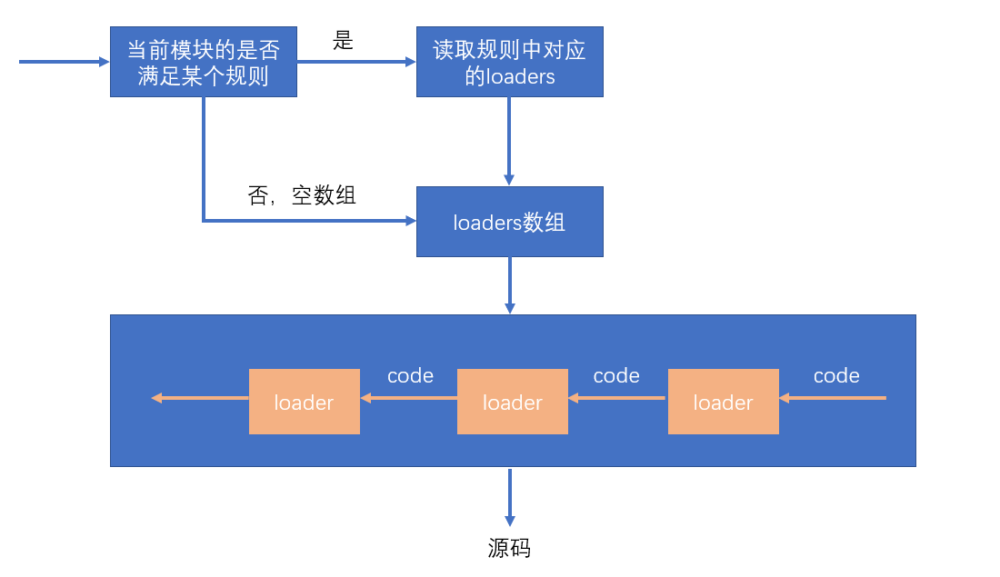

# loader

> webpack做的事情，仅仅是分析出各种模块的依赖关系，然后形成资源列表，最终打包生成到指定的文件中。
> 更多的功能需要借助webpack loaders和webpack plugins完成。

webpack loader： loader本质上是一个函数，它的作用是将某个源码字符串转换成另一个源码字符串返回。



loader函数的将在模块解析的过程中被调用，以得到最终的源码。

**全流程：**



**chunk中解析模块的流程：**



**chunk中解析模块的更详细流程：**



**处理loaders流程：**



**loader配置：**

**完整配置**

```js
module.exports = {
    module: { //针对模块的配置，目前版本只有两个配置，rules、noParse
        rules: [ //模块匹配规则，可以存在多个规则
            { //每个规则是一个对象
                test: /\.js$/, //匹配的模块正则
                use: [ //匹配到后应用的规则模块
                    {  //其中一个规则
                        loader: "模块路径", //loader模块的路径，该字符串会被放置到require中
                        options: { //向对应loader传递的额外参数

                        }
                    }
                ]
            }
        ]
    }
}
```

**简化配置**

```js
module.exports = {
    module: { //针对模块的配置，目前版本只有两个配置，rules、noParse
        rules: [ //模块匹配规则，可以存在多个规则
            { //每个规则是一个对象
                test: /\.js$/, //匹配的模块正则
                use: ["模块路径1", "模块路径2"]//loader模块的路径，该字符串会被放置到require中
            }
        ]
    }
}
```