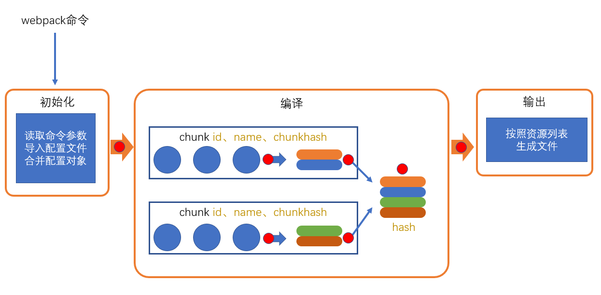
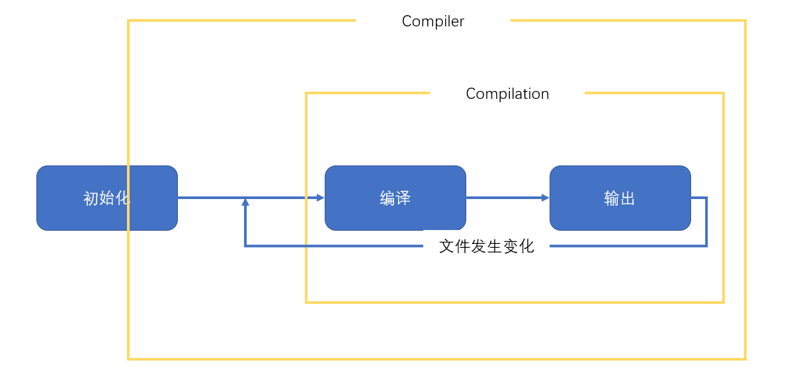

# plugin

loader的功能定位是转换代码，而一些其他的操作难以使用loader完成，比如：

- 当webpack生成文件时，顺便多生成一个说明描述文件
- 当webpack编译启动时，控制台输出一句话表示webpack启动了
- 当xxxx时，xxxx

这种类似的功能需要把功能嵌入到webpack的编译流程中，而这种事情的实现是依托于plugin的



plugin的**本质**是一个带有apply方法的对象

```js
var plugin = {
    apply: function(compiler){
        
    }
}
```

通常，习惯上，我们会将该对象写成构造函数的模式

```js
class MyPlugin{
    apply(compiler){

    }
}

var plugin = new MyPlugin();
```

要将插件应用到webpack，需要把插件对象配置到webpack的plugins数组中，如下：

```js
module.exports = {
    plugins:[
        new MyPlugin()
    ]
}
```

apply函数会在初始化阶段，创建好Compiler对象后运行。

compiler对象是在初始化阶段构建的，整个webpack打包期间只有一个compiler对象，后续完成打包工作的是compiler对象内部创建的compilation

apply方法会在**创建好compiler对象后调用**，并向方法传入一个compiler对象



compiler对象提供了大量的钩子函数（hooks，可以理解为事件），plugin的开发者可以注册这些钩子函数，参与webpack编译和生成。

你可以在apply方法中使用下面的代码注册钩子函数:

```js
class MyPlugin{
    apply(compiler){
        compiler.hooks.事件名称.事件类型(name, function(compilation){
            //事件处理函数
        })
    }
}
```

**事件名称**

即要监听的事件名，即钩子名，所有的钩子：https://www.webpackjs.com/api/compiler-hooks

**事件类型**

这一部分使用的是 Tapable API，这个小型的库是一个专门用于钩子函数监听的库。

它提供了一些事件类型：

- tap：注册一个同步的钩子函数，函数运行完毕则表示事件处理结束
- tapAsync：注册一个基于回调的异步的钩子函数，函数通过调用一个回调表示事件处理结束
- tapPromise：注册一个基于Promise的异步的钩子函数，函数通过返回的Promise进入已决状态表示事件处理结束

**处理函数**

处理函数有一个事件参数```compilation```