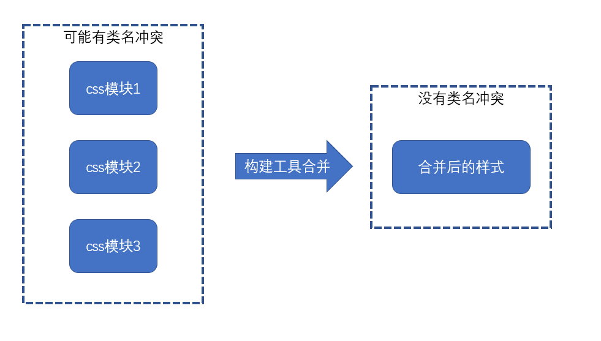
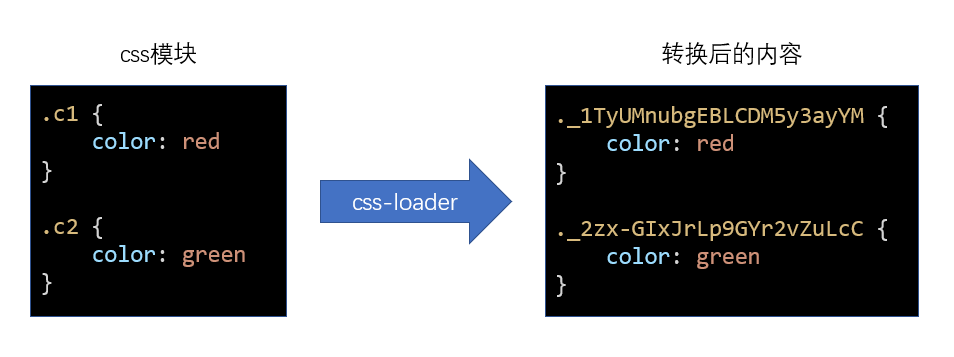
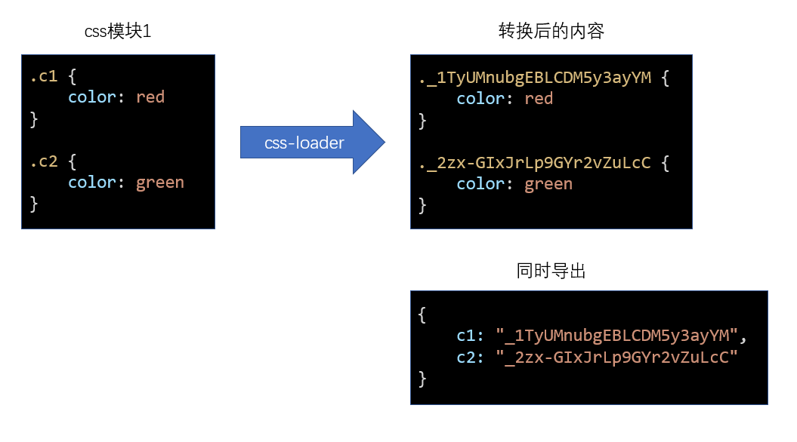

# css module {ignore}

> 通过命名规范来限制类名太过死板，而css in js虽然足够灵活，但是书写不便。
> css module 开辟一种全新的思路来解决类名冲突的问题

## 思路

css module 遵循以下思路解决类名冲突问题：

1. css的类名冲突往往发生在大型项目中
2. 大型项目往往会使用构建工具（webpack等）搭建工程
3. 构建工具允许将css样式切分为更加精细的模块
4. 同JS的变量一样，每个css模块文件中难以出现冲突的类名，冲突的类名往往发生在不同的css模块文件中
5. 只需要保证构建工具在合并样式代码后不会出现类名冲突即可



## 实现原理

在webpack中，作为处理css的css-loader，它实现了css module的思想，要启用css module，需要将css-loader的配置```modules```设置为```true```。

css-loader的实现方式如下：



原理极其简单，开启了css module后，css-loader会将样式中的类名进行转换，转换为一个唯一的hash值。

由于hash值是根据模块路径和类名生成的，因此，不同的css模块，哪怕具有相同的类名，转换后的hash值也不一样。


## 如何应用样式

css module带来了一个新的问题：源代码的类名和最终生成的类名是不一样的，而开发者只知道自己写的源代码中的类名，并不知道最终的类名是什么，那如何应用类名到元素上呢？

为了解决这个问题，css-loader会导出原类名和最终类名的对应关系，该关系是通过一个对象描述的



这样一来，我们就可以在js代码中获取到css模块导出的结果，从而应用类名了

style-loader为了我们更加方便的应用类名，会去除掉其他信息，仅暴露对应关系

## 其他操作

### 全局类名

某些类名是全局的、静态的，不需要进行转换，仅需要在类名位置使用一个特殊的语法即可：

```css
:global(.main){
    ...
}
```

使用了global的类名不会进行转换，相反的，没有使用global的类名，表示默认使用了local

```css
:local(.main){
    ...
}
```

使用了local的类名表示局部类名，是可能会造成冲突的类名，会被css module进行转换

### 如何控制最终的类名

绝大部分情况下，我们都不需要控制最终的类名，因为控制它没有任何意义

如果一定要控制最终的类名，需要配置css-loader的```localIdentName```

## 其他注意事项

- css module往往配合构建工具使用
- css module仅处理顶级类名，尽量不要书写嵌套的类名，也没有这个必要
- css module仅处理类名，不处理其他选择器
- css module还会处理id选择器，不过任何时候都没有使用id选择器的理由
- 使用了css module后，只要能做到让类名望文知意即可，不需要遵守其他任何的命名规范