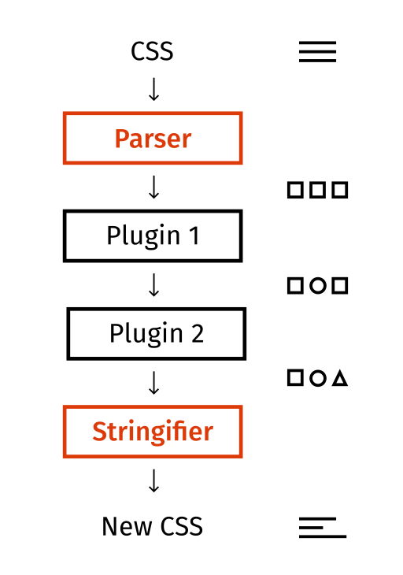
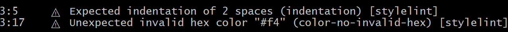

# PostCss {ignore}

> 本节课的内容和webpack无关！！！

# 什么是PostCss

学习到现在，可以看出，CSS工程化面临着诸多问题，而解决这些问题的方案多种多样。

如果把CSS单独拎出来看，光是样式本身，就有很多事情要处理。

既然有这么多事情要处理，何不把这些事情集中到一起统一处理呢？

PostCss就是基于这样的理念出现的。

PostCss类似于一个编译器，可以将样式源码编译成最终的CSS代码


看上去是不是和LESS、SASS一样呢？

但PostCss和LESS、SASS的思路不同，它其实只做一些代码分析之类的事情，将分析的结果交给插件，具体的代码转换操作是插件去完成的。


官方的一张图更能说明postcss的处理流程：



> 这一点有点像webpack，webpack本身仅做依赖分析、抽象语法树分析，其他的操作是靠插件和加载器完成的。

官网地址：https://postcss.org/
github地址：https://github.com/postcss/postcss

# 安装

PostCss是基于node编写的，因此可以使用npm安装

```shell
npm i -D postcss
```

postcss库提供了对应的js api用于转换代码，如果你想使用postcss的一些高级功能，或者想开发postcss插件，就要api使用postcss，api的文档地址是：http://api.postcss.org/

不过绝大部分时候，我们都是使用者，并不希望使用代码的方式来使用PostCss

因此，我们可以再安装一个postcss-cli，通过命令行来完成编译

```shell
npm i -D postcss-cli
```

postcss-cli提供一个命令，它调用postcss中的api来完成编译

命令的使用方式为：

```shell
postcss 源码文件 -o 输出文件
```

# 配置文件

和webpack类似，postcss有自己的配置文件，该配置文件会影响postcss的某些编译行为。

配置文件的默认名称是：```postcss.config.js```

例如：

```js
module.exports = {
    map: false, //关闭source-map
}
```

# 插件

光使用postcss是没有多少意义的，要让它真正的发挥作用，需要插件

postcss的插件市场：https://www.postcss.parts/

下面罗列一些postcss的常用插件

## postcss-preset-env

过去使用postcss的时候，往往会使用大量的插件，它们各自解决一些问题

这样导致的结果是安装插件、配置插件都特别的繁琐

于是出现了这么一个插件`postcss-preset-env`，它称之为`postcss预设环境`，大意就是它整合了很多的常用插件到一起，并帮你完成了基本的配置，你只需要安装它一个插件，就相当于安装了很多插件了。

安装好该插件后，在postcss配置中加入下面的配置

```js
module.exports = {
    plugins: {
        "postcss-preset-env": {} // {} 中可以填写插件的配置
    }
}
```

该插件的功能很多，下面一一介绍

### 自动的厂商前缀

某些新的css样式需要在旧版本浏览器中使用厂商前缀方可实现

例如

```css
::placeholder {
    color: red;
}
```

该功能在不同的旧版本浏览器中需要书写为

```css
::-webkit-input-placeholder {
    color: red;
}
::-moz-placeholder {
    color: red;
}
:-ms-input-placeholder {
    color: red;
}
::-ms-input-placeholder {
    color: red;
}
::placeholder {
    color: red;
}
```

要完成这件事情，需要使用`autoprefixer`库。

而`postcss-preset-env`内部包含了该库，自动有了该功能。

如果需要调整**兼容的浏览器**范围，可以通过下面的方式进行配置

**方式1：在postcss-preset-env的配置中加入browsers**

```js
module.exports = {
    plugins: {
        "postcss-preset-env": {
            browsers: [
                "last 2 version",
                "> 1%"
            ]
        } 
    }
}
```

**方式2【推荐】：添加 .browserslistrc 文件**

创建文件`.browserslistrc`，填写配置内容

```
last 2 version
> 1%
```

**方式3【推荐】：在package.json的配置中加入browserslist**

```json
"browserslist": [
    "last 2 version",
    "> 1%"
]
```

`browserslist`是一个多行的（数组形式的）标准字符串。

它的书写规范多而繁琐，详情见：https://github.com/browserslist/browserslist

一般情况下，大部分网站都使用下面的格式进行书写

```
last 2 version
> 1% in CN
not ie <= 8
```

- `last 2 version`: 浏览器的兼容最近期的两个版本
- `> 1% in CN`: 匹配中国大于1%的人使用的浏览器， `in CN`可省略
- `not ie <= 8`: 排除掉版本号小于等于8的IE浏览器

> 默认情况下，匹配的结果求的是并集

你可以通过网站：https://browserl.ist/ 对配置结果覆盖的浏览器进行查询，查询时，多行之间使用英文逗号分割

> browserlist的数据来自于[CanIUse](http://caniuse.com/)网站，由于数据并非实时的，所以不会特别准确

### 未来的CSS语法

CSS的某些前沿语法正在制定过程中，没有形成真正的标准，如果希望使用这部分语法，为了浏览器兼容性，需要进行编译

过去，完成该语法编译的是`cssnext`库，不过有了`postcss-preset-env`后，它自动包含了该功能。

你可以通过`postcss-preset-env`的`stage`配置，告知`postcss-preset-env`需要对哪个阶段的css语法进行兼容处理，它的默认值为2

```js
"postcss-preset-env": {
    stage: 0
}
```

一共有5个阶段可配置：

- Stage 0: Aspirational - 只是一个早期草案，极其不稳定
- Stage 1: Experimental - 仍然极其不稳定，但是提议已被W3C公认
- Stage 2: Allowable - 虽然还是不稳定，但已经可以使用了
- Stage 3: Embraced - 比较稳定，可能将来会发生一些小的变化，它即将成为最终的标准
- Stage 4: Standardized - 所有主流浏览器都应该支持的W3C标准

了解了以上知识后，接下来了解一下未来的css语法，尽管某些语法仍处于非常早期的阶段，但是有该插件存在，编译后仍然可以被浏览器识别

#### 变量

未来的css语法是天然支持变量的

在`:root{}`中定义常用变量，使用`--`前缀命名变量

```css
:root{
    --lightColor: #ddd;
    --darkColor: #333;
}

a{
    color: var(--lightColor);
    background: var(--darkColor);
}
```

> 编译后，仍然可以看到原语法，因为某些新语法的存在并不会影响浏览器的渲染，尽管浏览器可能不认识
> 如果不希望在结果中看到新语法，可以配置`postcss-preset-env`的`preserve`为`false`

#### 自定义选择器

```css
@custom-selector :--heading h1, h2, h3, h4, h5, h6;
@custom-selector :--enter :focus,:hover;

a:--enter{
    color: #f40;
}

:--heading{
    font-weight:bold;
}

:--heading.active{
    font-weight:bold;
}
```

编译后

```css
a:focus,a:hover{
    color: #f40;
}

h1,h2,h3,h4,h5,h6{
    font-weight:bold;
}

h1.active,h2.active,h3.active,h4.active,h5.active,h6.active{
    font-weight:bold;
}
```

#### 嵌套

与LESS相同，只不过嵌套的选择器前必须使用符号`&`

```less
.a {
    color: red;
    & .b {
        color: green;
    }

    & > .b {
        color: blue;
    }

    &:hover {
        color: #000;
    }
}
```

编译后

```css
.a {
    color: red
}

.a .b {
    color: green;
}

.a>.b {
    color: blue;
}

.a:hover {
    color: #000;
}
```

## postcss-apply

该插件可以支持在css中书写属性集

类似于LESS中的混入，可以利用CSS的新语法定义一个CSS代码片段，然后在需要的时候应用它

```less
:root {
  --center: {
    position: absolute;
    left: 50%;
    top: 50%;
    transform: translate(-50%, -50%);
  };
}

.item{
    @apply --center;
}
```

编译后

```css
.item{
  position: absolute;
  left: 50%;
  top: 50%;
  -webkit-transform: translate(-50%, -50%);
  transform: translate(-50%, -50%);
}
```

> 实际上，该功能也属于cssnext，不知为何`postcss-preset-env`没有支持

## postcss-color-function

该插件支持在源码中使用一些颜色函数

```less
body {
    /* 使用颜色#aabbcc，不做任何处理，等同于直接书写 #aabbcc */
    color: color(#aabbcc);
    /* 将颜色#aabbcc透明度设置为90% */
    color: color(#aabbcc a(90%));
    /* 将颜色#aabbcc的红色部分设置为90% */
    color: color(#aabbcc red(90%));
    /* 将颜色#aabbcc调亮50%（更加趋近于白色），类似于less中的lighten函数 */
    color: color(#aabbcc tint(50%));
    /* 将颜色#aabbcc调暗50%（更加趋近于黑色），类似于less中的darken函数 */
    color: color(#aabbcc shade(50%));
}
```

编译后

```css
body {
    /* 使用颜色#aabbcc，不做任何处理，等同于直接书写 #aabbcc */
    color: rgb(170, 187, 204);
    /* 将颜色#aabbcc透明度设置为90% */
    color: rgba(170, 187, 204, 0.9);
    /* 将颜色#aabbcc的红色部分设置为90% */
    color: rgb(230, 187, 204);
    /* 将颜色#aabbcc调亮50%（更加趋近于白色），类似于less中的lighten函数 */
    color: rgb(213, 221, 230);
    /* 将颜色#aabbcc调暗50%（更加趋近于黑色），类似于less中的darken函数 */
    color: rgb(85, 94, 102);
}
```
## [扩展]postcss-import

该插件可以让你在`postcss`文件中导入其他样式代码，通过该插件可以将它们合并

> 由于后续的课程中，会将postcss加入到webpack中，而webpack本身具有依赖分析的功能，所以该插件的实际意义不大

## stylelint

> 官网：https://stylelint.io/

在实际的开发中，我们可能会错误的或不规范的书写一些css代码，stylelint插件会即时的发现错误

由于不同的公司可能使用不同的CSS书写规范，stylelint为了保持灵活，它本身并没有提供具体的规则验证

你需要安装或自行编写规则验证方案

通常，我们会安装`stylelint-config-standard`库来提供标准的CSS规则判定

安装好后，我们需要告诉stylelint使用该库来进行规则验证

告知的方式有多种，比较常见的是使用文件`.stylelintrc`

```json
//.styleintrc
{
  "extends": "stylelint-config-standard"
}
```

此时，如果你的代码出现不规范的地方，编译时将会报出错误

```css
body {
    background: #f4;
}
```



发生了两处错误：

1. 缩进应该只有两个空格
2. 十六进制的颜色值不正确

如果某些规则并非你所期望的，可以在配置中进行设置

```json
{
    "extends": "stylelint-config-standard",
    "rules": {
        "indentation": null
    }
}
```

设置为`null`可以禁用该规则，或者设置为4，表示一个缩进有4个空格。具体的设置需要参见stylelint文档：https://stylelint.io/

但是这种错误报告需要在编译时才会发生，如果我希望在编写代码时就自动在编辑器里报错呢？

既然想在编辑器里达到该功能，那么就要在编辑器里做文章

安装vscode的插件`stylelint`即可，它会读取你工程中的配置文件，按照配置进行实时报错

> 实际上，如果你拥有了`stylelint`插件，可以不需要在postcss中使用该插件了
