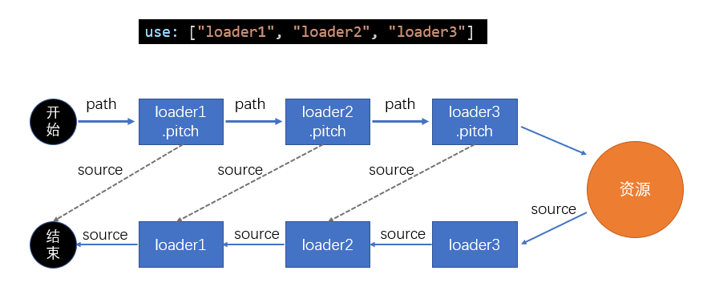

# 优化loader性能 {ignore}

## 进一步限制loader的应用范围

思路是：对于某些库，不使用loader

例如：babel-loader可以转换ES6或更高版本的语法，可是有些库本身就是用ES5语法书写的，不需要转换，使用babel-loader反而会浪费构建时间

lodash就是这样的一个库

> lodash是在ES5之前出现的库，使用的是ES3语法

通过`module.rule.exclude`或`module.rule.include`，排除或仅包含需要应用loader的场景

```js
module.exports = {
    module: {
        rules: [
            {
                test: /\.js$/,
                exclude: /lodash/,
                use: "babel-loader"
            }
        ]
    }
}
```

如果暴力一点，甚至可以排除掉`node_modules`目录中的模块，或仅转换`src`目录的模块

```js
module.exports = {
    module: {
        rules: [
            {
                test: /\.js$/,
                exclude: /node_modules/,
                //或
                // include: /src/,
                use: "babel-loader"
            }
        ]
    }
}
```

> 这种做法是对loader的范围进行进一步的限制，和noParse不冲突，想想看，为什么不冲突

## 缓存loader的结果

我们可以基于一种假设：如果某个文件内容不变，经过相同的loader解析后，解析后的结果也不变

于是，可以将loader的解析结果保存下来，让后续的解析直接使用保存的结果

`cache-loader`可以实现这样的功能

```js
module.exports = {
  module: {
    rules: [
      {
        test: /\.js$/,
        use: ['cache-loader', ...loaders]
      },
    ],
  },
};
```

有趣的是，`cache-loader`放到最前面，却能够决定后续的loader是否运行

实际上，loader的运行过程中，还包含一个过程，即`pitch`



`cache-loader`还可以实现各自自定义的配置，具体方式见文档

## 为loader的运行开启多线程

`thread-loader`会开启一个线程池，线程池中包含适量的线程

它会把后续的loader放到线程池的线程中运行，以提高构建效率

由于后续的loader会放到新的线程中，所以，后续的loader不能：

- 使用 webpack api 生成文件
- 无法使用自定义的 plugin api
- 无法访问 webpack options

> 在实际的开发中，可以进行测试，来决定`thread-loader`放到什么位置

**特别注意**，开启和管理线程需要消耗时间，在小型项目中使用`thread-loader`反而会增加构建时间